<!--
  ════════════════════════════════════════════════════════════════
   Chinnadurai S U — GitHub Profile README
   Repo name MUST equal your username (chinnadurai-su) to show on profile.
   All local art lives in ./ Live cards use trusted 3rd-party services.
   ════════════════════════════════════════════════════════════════
-->

<!-- ============================ HERO BANNER (dark / light auto-switch) ============================ -->
<div align="center">

<picture>
  <source media="(prefers-color-scheme: light)" srcset="./banner-light.svg">
  <source media="(prefers-color-scheme: dark)"  srcset="./banner.svg">
  
</picture>

<!-- ============================ TYPING HEADLINE ============================ -->
<a href="#">
  
</a>

<!-- ============================ SOCIAL BADGES ============================ -->
<p>
  <a href="https://www.linkedin.com/in/chinnadurai-s-u-4b6073101/"></a>
  <a href="mailto:chinnaduraisu23@gmail.com"></a>
  <a href="https://github.com/chinnadurai-su"></a>
  <!-- TODO: replace # with your live portfolio URL -->
  <a href="#"></a>
  
</p>

</div>

<!-- ============================ ABOUT + LANYARD ============================ -->
<table>
<tr>
<td width="62%" valign="top">

### 🧑‍💻 About Me

```ts
const chinnadurai = {
  role: "Senior Associate Projects @ Cognizant",
  location: "Chennai, India 🇮🇳",
  focus: ["Angular", "TypeScript", "Node.js", "Full Stack"],
  experience: "7+ years shipping production apps",
  currentlyLearning: "System Design & Scalable Architecture",
  philosophy: "Clean code, elegant UI, ship value.",
  motto: "Code. Coffee. Repeat. ☕"
};
```

- 🔭 Building **scalable enterprise applications** with Angular + Node.js
- 🎨 Passionate about **elegant UI/UX** and **clean architecture**
- 🌱 Currently deep-diving into **System Design** & **distributed systems**
- 💬 Ask me about **Angular, RxJS, NgRx, TypeScript, REST APIs**
- ⚡ Fun fact: *I believe great software is 50% empathy, 50% engineering.*

</td>
<td width="38%" valign="top" align="center">



</td>
</tr>
</table>

<!-- ============================ CURRENT FOCUS ============================ -->
<div align="center">

### 🎯 Current Focus

</div>

| 🚀 Shipping | 🌱 Learning | 🛠️ Improving |
|:-----------:|:-----------:|:------------:|
| Scalable Angular micro-frontends | System Design fundamentals | Test coverage & CI/CD |
| Node.js REST & real-time APIs | Distributed caching patterns | Performance & Core Web Vitals |
| Reusable component libraries |  | Clean architecture at scale |

<!-- ============================ TECH STACK ============================ -->
<div align="center">

### 🧰 Tech Stack


<br><br>


</div>

<!-- ============================ SKILL BARS (custom animated) ============================ -->
<div align="center">

### 📊 Skill Proficiency



</div>

<!-- ============================ FEATURED PROJECTS ============================ -->
<div align="center">

### 🌟 Featured Projects

</div>

<div align="center">
<em>🚧 Curating my best work — <a href="https://github.com/chinnadurai-su?tab=repositories">browse all repositories →</a></em>
</div>

<!--
  TO ENABLE PINNED PROJECT CARDS:
  1. Replace REPO_NAME_1 / REPO_NAME_2 with the exact names of two of your public repos.
  2. Delete the "Curating my best work" line above and uncomment this block.

<table>
<tr>
<td width="50%">
  <a href="https://github.com/chinnadurai-su/REPO_NAME_1">
    
  </a>
</td>
<td width="50%">
  <a href="https://github.com/chinnadurai-su/REPO_NAME_2">
    
  </a>
</td>
</tr>
</table>
-->


<!-- ============================ GITHUB STATS (live) ============================ -->
<div align="center">

### 📈 GitHub Stats


<br>


</div>

<!-- ============================ TROPHIES ============================ -->
<div align="center">

### 🏆 Trophies



<!-- Prefer LIVE trophies (real achievement grades, but the free instance is often rate-limited)?
     Replace the line above with:

-->


</div>

<!-- ============================ CONTRIBUTION GRAPH ============================ -->
<div align="center">

### 📉 Contribution Graph


</div>

<!-- ============================ SNAKE ============================ -->
<div align="center">

### 🐍 Contribution Snake

<picture>
  <source media="(prefers-color-scheme: dark)"  srcset="https://raw.githubusercontent.com/chinnadurai-su/chinnadurai-su/output/github-snake-dark.svg">
  <source media="(prefers-color-scheme: light)" srcset="https://raw.githubusercontent.com/chinnadurai-su/chinnadurai-su/output/github-snake.svg">
  
</picture>

</div>

<!-- ============================ QUOTE ============================ -->
<div align="center">

### 💭 Dev Quote


</div>

<!-- ============================ CONNECT ============================ -->
<div align="center">

### 🤝 Let's Connect

*"Building scalable applications, crafting elegant UI, and learning something new every day."*

<a href="https://www.linkedin.com/in/chinnadurai-s-u-4b6073101/"></a>
<a href="mailto:chinnaduraisu23@gmail.com"></a>

</div>

<!-- ============================ FOOTER WAVE ============================ -->

